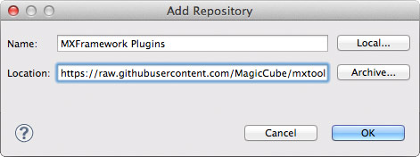
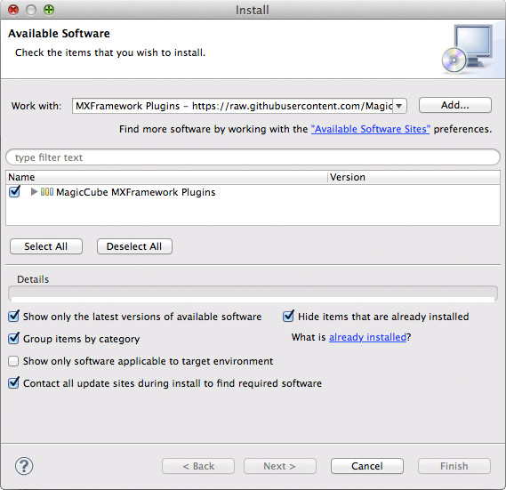
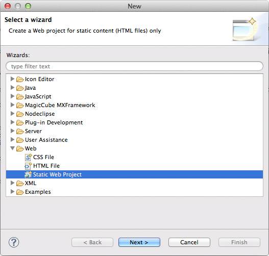
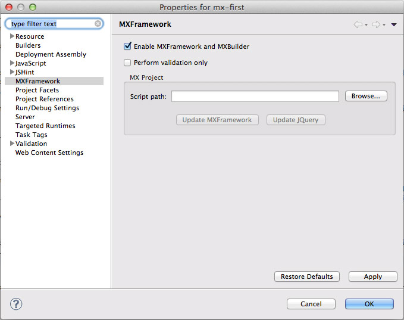
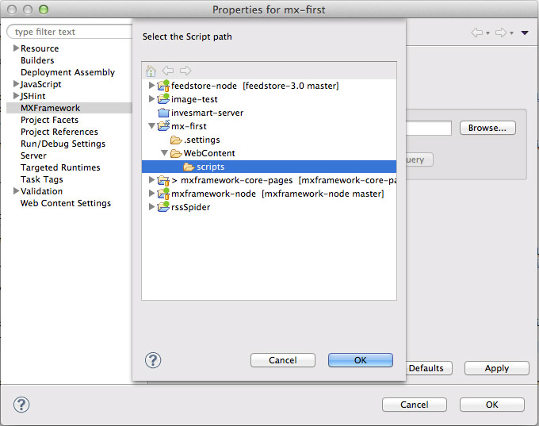
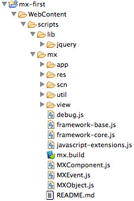



# Setup Development Environment

## Download
The latest build of MXFramework is hosted on GitHub. Click on the following link to download the latest source code from GitHub.

[https://github.com/MagicCube/mxframework-core/archive/master.zip](https://github.com/MagicCube/mxframework-core/archive/master.zip)


## What's included
Once downloaded, unzip the file to a new folder named `mx`, within which you'll find the following directories and files.
These include all you need for MXFramework. 

```
mx
├── app
│   └── Application.js
├── res
│   ├── images
│   │   └── mx-logo-32.png
│   └── locales
│       ├── en
│       │   └── language.js
│       └── zh-cn
│           └── language.js
├── scn
│   └── Scene.js
├── util
│   └── ObjectPool.js
├── view
│   └── View.js
├── debug.js
├── framework-base.js
├── framework-core.js
├── javascript-extensions.js
├── mx.build
├── MXComponent.js
├── MXEvent.js
├── MXObject.js
└── README.md 
```  

## Dependencies
MXFramework only requires [jQuery](http://jquery.com) library at the run time. It is recommended to use jQuery 1.10 or later version.

## Eclipse Plugins
Although you can complete the following setup steps all by your hands, it is still the best way to start your MXFramework journey by installing the MXFramework Plugins for [Eclipse](http://eclipse.org/).

### Install
1. Start your Eclipse, choose `Help > Install New Software` in the menu bar.
-  Click `Add`, in the top-right corner.
-  In the `Add Repository` dialog that appears, enter `MXFramework Plugin` for the `Name` and the following URL for the `Location`:
```
https://raw.githubusercontent.com/MagicCube/mxtool/master/mxtool-eclipse-updatesite/site.xml
```
-  Click `OK`.
-  In the `Available Software` dialog, select the checkbox next to `MagicCube MXFramework Plugins` and click `Next`.
-  Click `Next`, and complete the following installation. 
-  After the installation completes, restart Eclipse.

>  For the convenience of the beginner, in the following sections we'll only discuss how to setup your environment by using the plugins.

# Write your first MX application
In the next couple of minutes, we'll demonstrate how to quickly create a web application based on MXFramework. 

## Create a web project
1. In Eclipse, launch the New Project Wizard through `File > Project...`.
-  Select `Web > Static Web Project` and click `Next`.
-  Name the project as you like then click `Finish`.
-  Now you create an empty standard web project with the root content path named `WebContent`, in which you can store your publishable resources.
-  If you have a local web server like [IIS](http://www.iis.net/learn/install/installing-iis-7/installing-iis-on-windows-vista-and-windows-7) or [Apache](http://httpd.apache.org/docs/2.2/platform/windows.html), you may point the root web path to the `WebContent` folder for local testing.  

>  In practice, you can create any type of web project instead, or even use MXFramework in a non-web project.

## Enable MXFramework
1. Create a new folder named `scripts` under `WebContent`. This is where you store your JavaScript, CSS and other related resources including MXFramework itself.
-  Right click on the project and click `Properties` to open the project properties dialog.
-  In the left side navigation list, choose `MXFramework`. 
-  Select the checkbox next to `Enable MXFramework and Builder`.
-  Click `Browser` button.
-  Select the `scripts` folder we've just created and click `OK`. 
-  Confirm when you see the upcomming two dialogs to automatically install `jQuery 2.0` and the latest version of `MXFramework` from Internet.
-  Click `OK` to close the project properties dialog. 
-  Once finished, your project will look like this
   MXFramework is now installed in the `scripts/mx` folder which also called the "mx" module, while jQuery is under `scripts/lib` where you can also put frameworks or libraries from other third parties.

>  Of course if you want to build the MXFramework project manually, please strickly keep your script folder like what you see here.
>
>  Alternatively, you can use other name for the script folder, and basically the folder could be put in anywhere as you like. But remember to change the `Script path` in the project properties dialog accordingly.

## Create a simple view


## Create an application

## What's next
I bet you already know how to setup the development environment and some basic concept in MXFramework.
Now you may jump to the [Documents](./) page to find out more interesting contents.

Continue reading:
 
+ Write a master-detail applicatio
+ MXFramework cheat sheet
+ Other Documents