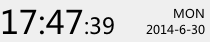
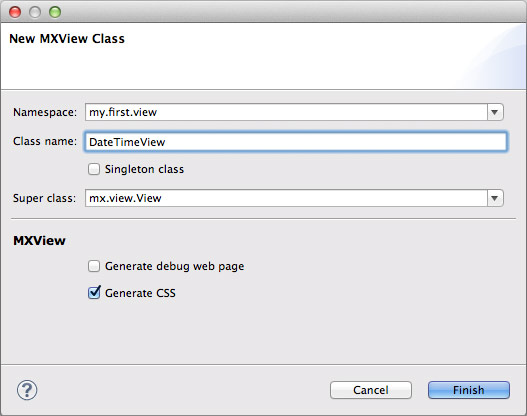
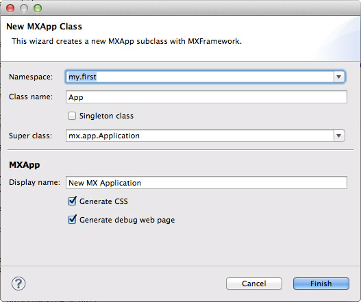



# Setup Development Environment

## Download
The latest build of MXFramework is hosted on GitHub. Click on the following link to download the latest source code from GitHub.

[https://github.com/MagicCube/mxframework-core/archive/master.zip](https://github.com/MagicCube/mxframework-core/archive/master.zip)


## What's included
Once downloaded, unzip the file to a new folder named `mx`, within which you'll find the following directories and files.
These include all you need for MXFramework. 

```
mx
├── app
│   └── Application.js
├── res
│   ├── images
│   │   └── mx-logo-32.png
│   └── locales
│       ├── en
│       │   └── language.js
│       └── zh-cn
│           └── language.js
├── scn
│   └── Scene.js
├── util
│   └── ObjectPool.js
├── view
│   └── View.js
├── debug.js
├── framework-base.js
├── framework-core.js
├── javascript-extensions.js
├── mx.build
├── MXComponent.js
├── MXEvent.js
├── MXObject.js
└── README.md 
```  

## Dependencies
MXFramework only requires [jQuery](http://jquery.com) library at the run time. It is recommended to use jQuery 1.10 or later version.

## Eclipse Plugins
Although you can complete the following setup steps all by your hands, it is still the best way to start your MXFramework journey by installing the MXFramework Plugins for [Eclipse](http://eclipse.org/).

### Install
1. Start your Eclipse, choose `Help > Install New Software` in the menu bar.
-  Click `Add`, in the top-right corner.
-  In the `Add Repository` dialog that appears, enter `MXFramework Plugin` for the `Name` and the following URL for the `Location`:
```
https://raw.githubusercontent.com/MagicCube/mxtool/master/mxtool-eclipse-updatesite/site.xml
```
-  Click `OK`.
-  In the `Available Software` dialog, select the checkbox next to `MagicCube MXFramework Plugins` and click `Next`.
-  Click `Next`, and complete the following installation. 
-  After the installation completes, restart Eclipse.

> **Tips**
>
>  For the convenience of the beginner, in the following sections we'll only discuss how to setup your environment by using the plugins.

# Basic concepts
Before writing code, there are some basic concepts about MXFramework you should learn first.

## Project with MXFramework
The same concept as a Eclipse project, and usually it's a Web Project.

## Modules in MXFramework
You can define several modules in an MX project.
The module name is recommended to be short and in lower-case like "sys", "fs" or "g3d".
Every module has its own folder which has the same name as the module.
For example, the codes of module `MODULE_NAME` should be put into the folder `scripts/MODULE_NAME`, and all its resources like CSSs, images and localization files should be stored under the `scripts/MODULE_NAME/res` folder.

A common folder structure is look like this

```
scripts
├── mx
│   ├── res
│   │   └── locales
│   │       ├── en
│   │       │   └── language.js
│   │       └── zh-cn
│   │           └── language.js
│   ├── debug.js
│   ├── framework-base.js
│   ├── framework-core.js
│   └── ...
├── mod1
│   ├── res
│   │   ├── images
│   │   ├── locales
│   │   │   ├── en
│   │   │   │   └── language.js
│   │   │   └── zh-cn
│   │   │       └── language.js
│   │   └── AClassView.css
│   │   └── BClassView.css
│   ├── logic
│   │   ├── XClass.js
│   │   └── YClass.js
│   └── view
│       ├── AClassView.js
│       └── BClassView.js
├── mod2
│   ├── res
│   │   ├── images
│   │   └── CClassView.css
│   │   └── DClassView.css
│   └── view
│       ├── CClassView.js
│       └── DClassView.js
└── ...
```

Unlike the [AMD(Asynchronous Module Definition)](http://requirejs.org/docs/whyamd.html) and many other modularized frameworks, there's no explicit definition for the module dependencies in MXFramework.
Both static and dynamic module loading are handled by the framework. When you import a class from "A module" for the first time, the framework will automatically asynchronously or synchronously load the module before you go. 

Concerning the performance and efficiency, in the `production mode`, after running a building process using `MXBuild`, all the JavaScript codes inside the module will be compiled into one file named `min.js` under the `scripts/MODULE_NAME` folder, while CSS will be compressed into a `min.css` file under `scripts/MODULE_NAME/res`.

The folder structure in production mode should look like this

```
scripts
├── mx
│   ├── res
│   │   └── locales
│   │       ├── en
│   │       │   └── language.js
│   │       └── zh-cn
│   │           └── language.js
│   └── min.js
├── mod1
│   ├── res
│   │   ├── images
│   │   ├── locales
│   │   │   ├── en
│   │   │   │   └── language.js
│   │   │   └── zh-cn
│   │   │       └── language.js
│   │   └── min.css
│   └── min.js
├── mod2
│   ├── res
│   │   ├── images
│   │   └── min.css
│   └── min.js
└── ...
```

By default, there's always a framework-level module named `mx` stored in `scripts/mx`.

Please read [Object Oriented Programming Guide](object-oriented-programming-guide.html) for further information.

## Applications in MXFramework
There could be several applications inside one module. Basically you could regard the applications as the traditional web pages.
Every application class should inherit from `mx.app.Application` which has a `run(options)` function.
After initialization, you call the `run` function directly to start the application with specific `options`.

## Views in MXFramewrok
A View in MXFramework represents a UI component which can display informations and interact with the users.
View often comes with a JavaScript and a CSS file, both of the file share the same name but different extensions.
Usually a View is related to a HTML element, and View has a `$container` field which is pointed to a jQuery object of the HTML element.
Every View class should inherit from `mx.view.View`.

Views can also be nested, which means a View can have some sub views (their parent is called parentView), and the `mx.app.Application` class itself inherits `from mx.view.View` as well.

Please read [UI Programming Guide](ui-programming-guide.html) for further information.

# Write your first MX application
In the next couple of minutes, we are going to make a simple application which display the current time in the following way.



## Create a web project
1. In Eclipse, launch the New Project Wizard through `File > Project...`.
-  Select `Web > Static Web Project` and click `Next`.
-  Name the project as you like then click `Finish`.
-  Now you create an empty standard web project with the root content path named `WebContent`, in which you can store your publishable resources.
-  If you have a local web server like [IIS](http://www.iis.net/learn/install/installing-iis-7/installing-iis-on-windows-vista-and-windows-7) or [Apache](http://httpd.apache.org/docs/2.2/platform/windows.html),
   you may point the root web path to the `WebContent` folder for local testing.  

> **Tips**
>
>  In practice, you can create any type of web project instead, or even use MXFramework in a non-web project.

## Enable MXFramework
1. Create a new folder named `scripts` under `WebContent`. This is where you store your JavaScript, CSS and other related resources including MXFramework itself.
-  Right click on the project and click `Properties` to open the project properties dialog.
-  In the left side navigation list, choose `MXFramework`. 
-  Select the checkbox next to `Enable MXFramework and Builder`.
-  Click `Browser` button.
-  Select the `scripts` folder we've just created and click `OK`. 
-  Confirm when you see the upcomming two dialogs to automatically install `jQuery 2.0` and the latest version of `MXFramework` from Internet.
-  Click `OK` to close the project properties dialog. 
-  Once finished, your project will look like this
   MXFramework is now installed in the `scripts/mx` folder which also called the "mx" module, while jQuery is under `scripts/lib` where you can also put frameworks or libraries from other third parties.

> **Tips**
>
>  ou can also build the MXFramework project manually, please strickly follow the script folder structure like what you see here.
>
>  Alternatively, you can use other name for the script folder, and basically the folder could be put in anywhere as you like. But remember to change the `Script path` in the project properties dialog accordingly.

## Create a view
Now you're going to write your first class based MXFramework.

1. Right click on the project, and select `MXFramework > New MX View` in the pop-up menu.
-  In the wizard, fill in the `Namespace` field with `my.first.view` and `Class name` with `DateTimeView`, then click `Finish`. 
   There will be two files generated
   - `WebContent/scripts/my/first/view/DateTimeView.js` - Where to put your logical code of view. 
   - `WebContent/scripts/my/res/DateTimeView.css` - Where you can embellish your view.
-  Open the `DateTimeView.js`, override with the following code.

```javascript
// Define the namespace
$ns("my.first.view");

// Import the stylesheet
$include("my.res.DateTimeView.css");

// Define the class
my.first.view.DateTimeView = function()
{
    var me = $extend(mx.view.View);
    // Public fields from super class
    me.elementClass = "DateTimeView";
    me.frame = { width: 210 };
    var base = {};
    
    // Public fields
    me.displaySeconds = false;
    
    // Private fields
    var _$timeLabel = null;
    var _$secondLabel = null;
    var _$dateLabel = null;
    var _$dayLabel = null;

    // Override method from super class
    base.init = me.init;
    me.init = function(p_options)
    {
        base.init(p_options);
        _initLabels();
        me.update();
    };
    
    // Private initializations.
    function _initLabels()
    {
        _$timeLabel = $("<span id=time>");
        me.$container.append(_$timeLabel);
        
        if (me.displaySeconds)
        {
            _$secondLabel = $("<span id=second>");
            me.$container.append(_$secondLabel);
        }
        
        _$dateLabel = $("<span id=date>");
        me.$container.append(_$dateLabel);
        
        _$dayLabel = $("<span id=day>");
        me.$container.append(_$dayLabel);
    }
    
    // Public methods
    me.update = function()
    {
        var now = new Date();
        _$timeLabel.text($format(now, "HH:mm"));
        if (me.displaySeconds)
        {
            _$secondLabel.text($format(now, ":ss"));
        }
        _$dateLabel.text($format(now, "yyyy-M-d"));
        _$dayLabel.text(['SUN', 'MON', 'TUE', 'WED', 'THU', 'FRI', 'SAT'][now.getDay()]);
        // Change the CSS class to 'dark' during night.
        me.$container.toggleClass("dark", now.getHours() <= 6 && now.getHours() >= 18);
    };

    return me.endOfClass(arguments);
};
my.first.view.DateTimeView.className = "my.first.view.DateTimeView";
```

Please also modify the `DateTimeView.css`.
 
```css
.DateTimeView
{
    position: relative;
    display: block;
    background: #efefef;
}

.DateTimeView > #time
{
    font-size: 32px;
}

.DateTimeView > #second
{
    font-size: 22px;
}

.DateTimeView > #date
{
    position: absolute;
    bottom: 5px;
    right: 5px;
}

.DateTimeView > #day
{
    position: absolute;
    top: 5px;
    right: 5px;
}


.DateTimeView.dark
{
    background: #444;
}

.DateTimeView.dark > span
{
    color: white;
}
```

> **Tips**
>
> You can also open the `New MX View` dialog by selecting `File > New > Other...` and choose `MagicCube MXFramework > New MX View`.

## Create an application
Now we need a runnable application to contain and display the DateTimeView.

1. Right click on the project again, and select `MXFramework > New MX Application` in the pop-up menu.
-  In the `New MXApp Class` dialog, type 'my.first' for the `Namespace` and `App` for the `Class name`. 
-  Click `Finish` button. You're going to have 3 new files.
    - `WebContent/scripts/my/first/App.js`
    - `WebContent/scripts/my/res/App.css`
    - `WebContent/App-debug.html`
-  Change the `App.js` to the following code.

```javascript
$ns("my.first");

// Import the DateTimeView class.
$import("my.first.view.DateTimeView");

$include("my.res.App.css");

my.first.App = function()
{
    var me = $extend(mx.app.Application);
    me.appId = "my.first.App";
    me.appDisplayName = "New MX Application";
    var base = {};
    
    var _dateTimeView = null;

    base.init = me.init;
    me.init = function(p_options)
    {
        base.init(p_options);
        
        _initDateTimeView();
    };
    
    function _initDateTimeView()
    {
        // Create a DateTimeView with initial options.
        _dateTimeView = new my.first.view.DateTimeView({
            id: "dateTime",
            displaySeconds: true
        });
        // Add the _dateTimeView to application.
        me.addSubview(_dateTimeView);
    }

    base.run = me.run;
    me.run = function(args)
    {
        // Invoke the 'update' method every seconds.
        window.setInterval(function()
        {
            _dateTimeView.update();
        }, 1000);
    };

    return me.endOfClass(arguments);
};
my.first.App.className = "my.first.App";
```

## Run in debug mode

# Dive deeper

## Compile and build

## Run in production mode

# What's next
I bet you already know some basic concept in MXFramework and how to setup the development environment.
Now you may jump to the [Documents](./) page to find out more interesting contents.

Continue reading:
 
+ [Build a master-detail-view application](build-a-master-detail-view-application.html)
+ [Cheat sheet](cheat-sheet.html)
+ [Other Documents](./)